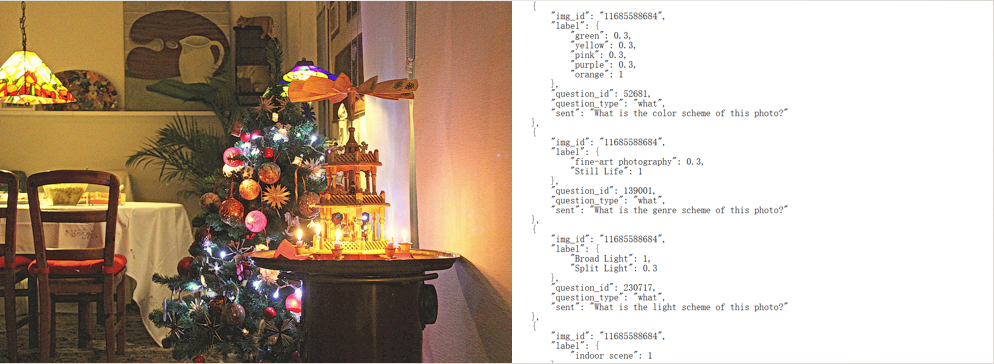

# AesVQA

This is an open-source aesthetic visual question answering dataset, which we completed in the [Victory team of Besti](https://www.victory-lab.net/).

There is a folder that includes pictures and a folder that includes pictures for questions and answers. The Images folder contains 90, 000 images from Flickr, an online photography site. The label folder contains 90,000 files, each file corresponds to an image, and each file contains one or more question and answer pairs of the corresponding image. There were 212,868 comments in total and there were an average of 2.3652 comments per image.

If you want to further understand and use this dataset, please apply by Request access.doc and send it to jinxinbesti@foxmail.com. We will tell you how to have an access to this dataset by email according to your application.

*************************************************************************************
### VQA datasets’ answer words length accounted for the proportion of all answers table.

| Dataset       |  One Word | Yes/No | Two Words or More     |  The Number of QA Pairs |
| :----------: | :-----------:  | :----------: | :-----------: | :----------: |
| VQAv2         |   51.2%  |  45.0%   |     3.8%      | 1,105,904 |
| Visual7W      |   51.2%  |  21.2%   |     27.6%     |139,868|
| Visual Genome |   52.5%  |  21.2%   |     26.3%     |1,445,233|
| AesVQA        |   51.0%  |  0%      |     59.0%    |345,354|

### The number of each question of AesVQA Dataset.

| Question      | The number of each question     |
| ---------- | :-----------:  |
| What is the light scheme of this photo?      |  59130     |
| What is the subject of this photo?           |  50337     |
| What is the technique of this photo?     | 17930     |
| What is the color scheme of this photo?      | 35152     |
| How does this photo feel?                    | 15695    |
| What is the genre scheme of this photo?      | 21483    |
| What is the composition of this photo?      | 13141    |
  
### example1
   
  

  
### example2

 
  
### Our Paper  
  
Xin Jin, Wu Zhou, Xinghui Zhou, Shuai Cui, Le Zhang, Jianwen Lv, Shu Zhao. Aesthetic Visual Question Answering of Photographs. Computer Vision and Pattern Recognition (cs.CV).  **[arXiv](https://arxiv.org/abs/2208.05798)**(2208.05798)


### Citation

Please cite the ACM Multimedia paper if you use DPC-Captions in your work:

```
@article{Jin2022AestheticVQ,
  title={Aesthetic Visual Question Answering of Photographs},
  author={Xin Jin and Wu Zhou and Xinghui Zhou and Shuai Cui and Le Zhang and Jianwen Lv and Shu Zhao},
  journal={ArXiv},
  year={2022},
  volume={abs/2208.05798}
}
```
